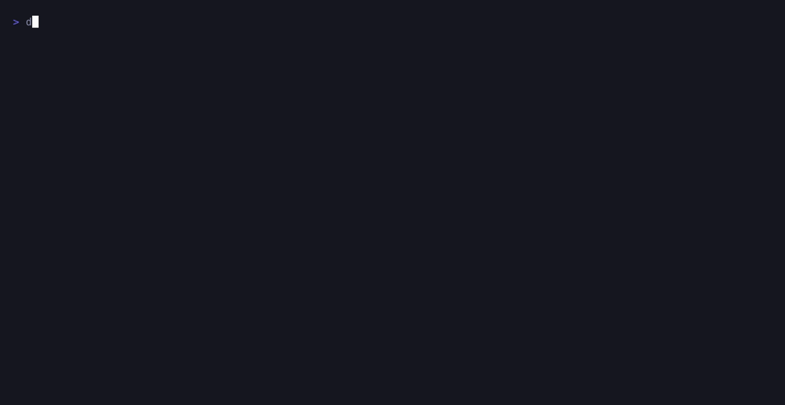
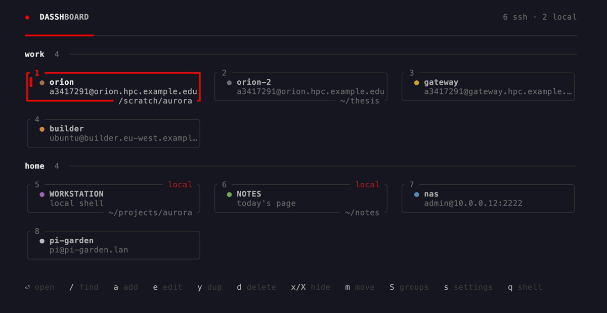

# dasshboard

[](https://pypi.org/project/dasshboard/)

A home screen for your terminal. Every host in `~/.ssh/config` — plus anything
you add yourself — becomes a clickable tile. Activating one connects: under
Ghostty on macOS that is a new tab tinted with the host's colour, and in every
other terminal it takes over the one you are already in.

The board is centred in both axes and tiles keep a fixed width — a wide terminal
gets whitespace, not vast tiles. The keys sit on the bottom edge of the screen,
where they stay put: they don't move up and down as tiles are added, hidden or
filtered, because they aren't part of the board.

```
   ◆  DASSHBOARD                                                5 ssh · 1 local
   ━━━━━━━━━━━━━━──────────────────────────────────────────────────────────────

   ┏ 1 ━━━━━━━━━━━━━━━━━━━━━━━━ local ┓  ╭ 2 ───────────────────────────────╮
   ┃▌ ● MACBOOK-PRO                   ┃  │  ● alex                          │
   ┃    local shell                   ┃  │    v120bb18@alex.nhr.fau.de ⤳    │
   ┗━━━━━━━━━━━━━━━━━━━━━━━━━━━━━━━━━━┛  ╰──────────────────────────────────╯


   ⏎ open   t/w/c where   / find   a add   e edit   y dup   d delete   x/X hide
```



Arrows or `hjkl` move, `⏎` opens. The session takes the terminal over — the
recording is made in a terminal that cannot open tabs for us, so every tile lands
here — and quitting it drops you back in the shell that started the home screen.

Tiles keep the order you put them in, and can be grouped under headings — `m`
moves one, `S` manages the groups. See [Order and groups](#order-and-groups).

*Every recording on this page is made with [vhs](https://github.com/charmbracelet/vhs)
against a machine that doesn't exist: the hosts, folders and notes are invented,
and `docs/demo/` holds the tapes and the fake `~/.ssh/config` behind them.*

Two kinds of tile:

- **ssh** — connects to a host.
- **local** (tagged `local`) — runs a command on this machine.

Both end up in the same three places, chosen by `open_in`: a **new tab**, a
**new window**, or **this terminal**. Taking over this terminal is the one that
works everywhere: dasshboard restores the terminal and then hands the session
the process, so it is replaced rather than nested, and quitting the session
returns you to the shell that started dasshboard.

## Compatibility

The TUI is portable — it is Rust and [ratatui](https://ratatui.rs), and it draws
the same picture everywhere. What is *not* portable is opening a **new tab**:
that needs the terminal to expose an automation interface, and today that means
Ghostty on macOS. So dasshboard has two levels, and picks between them by
looking at the terminal it was started in.

| | macOS + Ghostty | any other terminal (macOS, Linux, BSD) | Windows |
|---|---|---|---|
| the TUI, mouse, colours | ✅ | ✅ | ✅ |
| ssh tiles and local tiles | ✅ | ✅ | ✅ |
| open in **this terminal** | ✅ | ✅ | ✅ |
| open in a **new tab / window** | ✅ tinted, titled | → this terminal | → this terminal |
| the tab takes the tile's name + circle | ✅ | ✅ | ✅ |
| background tint on the new surface | ✅ | — | — |
| `--startup on` | ✅ zsh, bash | ✅ zsh, bash | by hand, see below |

**Level 1 — macOS running Ghostty ≥ 1.2.** Everything above. `t`/`w`/`c` pick a
new tab, a new window, or this one; the new surface carries the host's colour as
a background tint and its circle in the tab title.

**Level 2 — everywhere else.** Every tile opens in the terminal you launched
dasshboard from, `ssh` replacing the home screen and returning you to your shell
when it ends. That tab is still renamed after the tile — a title is an escape
sequence rather than an automation interface, so it needs nothing of the
terminal. Nothing is silently broken: `tab` and `window` still parse, still
save, and still travel in a config.toml shared between machines — they simply
resolve to `current` on a machine that cannot honour them, and the settings
panel says so. The `t`/`w`/`c` hints disappear from the footer, since there is
nothing to choose between.

Detection is on the **running** terminal (`TERM_PROGRAM`, or Ghostty's own
`GHOSTTY_*` variables), not on whether Ghostty is installed — otherwise pressing
`⏎` in iTerm would answer by opening a tab in a different application. Override
it with `DASSHBOARD_BACKEND=ghostty` or `DASSHBOARD_BACKEND=inplace` if that
guess is ever wrong.

What dasshboard asks of a terminal is otherwise ordinary: UTF-8, 24-bit colour
(it degrades to the nearest 256 in terminals without it), and mouse reporting if
you want to click tiles. On Windows use [Windows
Terminal](https://aka.ms/terminal) — `conhost.exe` will run it, but the box
drawing and the coloured circles are not worth looking at there. `ssh` itself
comes with Windows 10 1809 and later; `Add-WindowsCapability -Online -Name
OpenSSH.Client` if it is missing. Hosts are read from `%USERPROFILE%\.ssh\config`,
which is where OpenSSH for Windows puts them.

## Colour

The chrome is exactly two colours — a **primary** and an **accent**, `#aaaaaa`
and `#ff0000` out of the box — and the discipline is that **the accent is never
decoration**. It marks the selection, the brand diamond, and errors; nothing
else. Three tile states read as three border weights rather than three hues:
thick accent when selected, primary when hovered, hairline when idle.

Both are yours to change, in `s` or in `[theme]`. Everything else is *derived*
from the pair rather than listed separately, so a new primary restyles the whole
UI coherently instead of leaving four hand-picked greys behind:

| shade | from | used for |
|---|---|---|
| bright | primary → white, 73% | the one word that should stand out |
| muted | primary × 0.62 | secondary text |
| faint | primary × 0.34 | hairlines and idle borders |
| accent-dim | accent mixed 25% toward primary, × 0.70 | tags and hover |

The ratios were reverse-engineered from the original hand-picked palette, so the
defaults come out byte-identical to what they were before this became runtime —
`the_default_theme_reproduces_the_original_shades` pins that. In the settings
panel the arrows cycle presets and typing takes a hex; a colour is written the
moment it parses, so the UI restyles as you type and never flickers through a
half-finished value.


Each row is written through as you change it, so the file and the screen can
never disagree — the recording drops `~/.ssh/config` from the board and puts it
back, then takes the chrome from grey and red to one blue.

Hosts carry a **third** colour that is theirs alone, shown as the dot on the
tile. That palette deliberately excludes red — a host that owned red would be
indistinguishable from the cursor — and its eight entries are desaturated to sit
against `#aaaaaa` without shouting over it.

A name hashes to a preferred slot, and a taken slot probes forward to the next
free one, so no two tiles on screen share a colour. The trade-off is that a
host's colour depends on what else is on screen: adding a host can shift a
later one. Pin any host with `color = "#rrggbb"` and it never moves.

**The palette is sized to the emoji, not the other way round.** A tab title is
text, so a coloured circle is the only way a host's colour can reach the tab bar
itself — the background tint colours the surface, not the strip you actually
scan, and it is the one of the two that needs Ghostty. There are nine circle emoji and red is spoken for, which leaves
eight, one per palette slot. A richer palette would give two hosts the same
circle and defeat the point. A hand-written hex gets the nearest circle by RGB
distance, so `color = "#2255cc"` still shows 🔵.

One caveat: ⚫ is low-contrast on a dark tab bar. If a host lands on it and you'd
rather it didn't, pin that host to another colour.

## Keys

One key, one job. They come in four groups — **open**, **move around**,
**change the board**, **open a panel** — and no letter appears in two of them,
in either case.

| | |
|---|---|
| click / `⏎` / `space` | open the tile |
| `t` / `w` / `c` | open in a new tab / new window / this terminal, once (Ghostty only; elsewhere all three mean `c`) |
| `1`–`9` | open that numbered tile directly |
| arrows / `hjkl` | move (`j`/`k` move by a row, so they respect the grid) |
| `g` / `G` | first / last |
| `/` | find by name, target, or jump host; `esc` clears |
| `a` | add a tile |
| `e` | edit the selected tile — including hosts from `~/.ssh/config` |
| `y` | duplicate it, so the copy can start somewhere else |
| `d` | delete it (asks first) |
| `x` / `X` | hide it / show every hidden tile |
| `m` | grab it; the arrows then move *it*, `⏎` drops it |
| `s` | settings — whether it opens with a terminal, options, destination and both colours |
| `S` | groups — make, rename, reorder and delete the sections tiles sit in |
| `r` | re-read both config files |
| `q` / `esc` | quit into the shell underneath |

`/` is a lens on the board rather than a jump to one tile: it matches the name,
the target and the jump host, the headings count what is left, and the ones a
filter empties drop out of the way.


Duplicating used to be `D`, and it is `y` now because `d` deletes any tile
outright — the constructive verb should not be one shift key away from the
destructive one. Where a shift pair *is* used, the two halves belong together:
`x` puts one tile away, `X` shows everything that has been put away. That is the
one thing `s` used to do as a side job — the way back to a hidden host was the
settings panel, so `s` meant both "settings" and "how I get that host back". It
is a key of its own now. See [Hiding and deleting](#hiding-and-deleting).

## Folders and commands

A tile is **one** place and **one** thing to run. `folder` is where the session
starts, `command` is what runs there, and leaving either out gives you the
default: your home directory, and a login shell.

```toml
[[host]]
name = "alex"
folder = "/scratch/atlas"

[[local]]
label = "MACBOOK-PRO"
folder = "~/dasshboard-tui"
command = "nvim"
```

The **folder** shows up along the bottom edge of the tile, because two tiles for
one host are the same host and where each of them lands is the difference you
have to be able to see:

```
  ╭ 1 ───────────────────────────────╮  ╭ 2 ───────────────────────────────╮
  │  ● alex                          │  │  ● alex-2                        │
  │    v120bb18@alex.nhr.fau.de      │  │    v120bb18@alex.nhr.fau.de      │
  ╰────────────────── /scratch/atlas ╯  ╰───────────────────────── ~/thesis ╯
```

The command is deliberately *not* there. A tile has room for one short line, and
a destination is what a person scans a board for — an argv is longer, less
distinguishing, and already in the file. `/` still matches it, so a duplicate you
told apart by its command is still findable by it.

### The session outlives the command

A command need not be something you sit in. `cat today.md` prints three lines and
exits, and a session that *was* that command would die on the output it just
produced — a tab you cannot type in, or a home screen that blinked and came back.
So the command runs and then a shell takes over, in the same folder:


A tile with no command of its own is already a shell, has nothing to outlive, and
still `exec`s outright — no wrapper process, and quitting it falls straight
through to the shell that launched the home screen. For an ssh tile the shell
that follows is the far side's, inside the same remote command; for a local one it
is `$SHELL` here, which is why `dasshboard` sits behind it until you leave.

The shell that follows a command is a **plain** one: it carries `DASSHBOARD_SKIP`
like every shell below a home screen, and `NO_HSL` as well. Nothing that opens
with a new terminal opens in it — no second home screen, and no workspace manager
either, because quitting a `command = "herdr"` tile into a shell that starts herdr
again is a loop. The tile that *is* a shell is the one that still gets it, which
is the whole point of [The local tile](#the-local-tile).

### More than one folder is more than one tile

There is no picker any more. A host you open in three directories is three
tiles, and `y` is how you get them: it writes a copy of the selected tile —
same connection, same colour, its own name — directly below the original in
config.toml and beside it on screen. Then `e` says where the copy goes.


`alex` duplicates to `alex-2`, and `alex-2` to `alex-3` rather than `alex-2-2`:
a copy of a copy is another tile for the same host, not a nested one. A copy of
a host that only exists in `~/.ssh/config` can't inherit by name any more — it
has a different one — so the alias becomes its `hostname` and ssh does the same
lookup it would have done.

An older config's `folders = [...]` still loads, quietly: the first becomes
`folder` and the rest are dropped. It says nothing about it, because nothing has
just happened — the file has read that way since the day it was written, and a
status line on every start is noise. `y` is what gets a missing one back.

### How each kind gets there

The two kinds get there differently, because one directory is on this machine
and the other isn't:

- **local** — a real `cd` before the command runs, so argv stays exactly what
  you configured.
- **ssh** — the directory is on the far side, so it becomes a remote command:
  `ssh <alias> -t 'cd <dir> && exec ${SHELL:-/bin/sh} -l'`. The `-t` forces a
  tty, without which the remote shell isn't interactive; the `exec $SHELL -l`
  leaves you in a login shell in that folder rather than a bare `sh`. The alias
  still leads, so `IdentityFile` and friends keep applying.

A `command` of your own runs in place of that login shell, with the shell behind
it — `ssh <alias> -t 'cd <dir> && { tmux attach; exec ${SHELL:-/bin/sh} -l; }'` —
and is passed on as written, because it is a line for the remote shell and the
ones that are more than a program name wouldn't survive being second-guessed. The
braces are what keep the pair together: without them the `&&` would reach past
the group and a folder that isn't there would still open a shell, somewhere else.

A **local** `command` is split into argv on spaces, with quotes for the arguments
that contain them, and is never re-parsed by a shell — what runs is exactly what
you configured. Taking over this terminal, dasshboard runs it and then execs the
shell itself, with nothing in between; in a spawned tab the `sh` that already
carries the title runs both, each argv element quoted separately so a space in one
of them stays a space.

Paths are quoted for the shell that will read them, local or remote — and `~`
is handled on whichever side owns the home directory it means. A **local** one
is resolved here, because the destination is either a real `chdir` (which does
no expansion at all) or a quoted `cd` (which stops it), so `~/Desktop` would
otherwise be looked up as a directory *named* `~`. A **remote** one can't be
resolved here at all, so the tilde is left outside the quotes for the far side
to expand — `cd ~/'my dir'` — while the rest of the path stays one quoted word.
Only a leading `~` or `~/…`; `~user` needs a passwd lookup, and mid-path tildes
are literal in a shell too.

## Order and groups

Tiles are drawn in the order the config asks for, under whatever headings it
gives them. `m` grabs the tile under the cursor — its border doubles and it's
tagged `moving` — and the arrows then move the tile instead of the cursor:

```
  work  2  ────────────────────────────────────────────────

  ╭ 1 ───────────────────────────────╮  ╔ 2 ═══════ moving ╗
  │  ● mufasa                        │  ║  ● alex          ║
  │    mufasa                        │  ║    alex          ║
  ╰──────────────────────────────────╯  ╚══════════════════╝

  personal  1  ────────────────────────────────────────────

  ╭ 3 ───────────────────────────────╮
  │  ● MACBOOK-PRO                   │
  ╰──────────────────────────────────╯

  ←→ reorder   ↑↓ by a row   g/G to an end   ⏎ drop
```


`←`/`→` move it one place, `↑`/`↓` a row's worth, `g`/`G` to one end. There is
no separate "move to the next group" key because there doesn't need to be one:
step off the end of a group and the tile carries into the next, which makes
reordering within a group and moving between groups the same gesture. The cursor
travels with the tile, so a run of arrow presses feels like dragging one rather
than shuffling a list underneath a fixed cursor.

`S` is the groups themselves — `⏎` renames, `a` makes one, `d` deletes, `J`/`K`
reorder. Deleting a heading never deletes a host: the tiles join the group above
it, or the one below when it was the first. A group's membership isn't edited
here, because moving a tile into it already says everything a list of checkboxes
would.

Both write to `[[section]]` blocks:

```toml
[[section]]
title = "work"
items = ["alex", "csnhr"]

[[section]]
title = "personal"
items = ["MACBOOK-PRO"]
```

Membership is by **name** — a `name` or a `label` — rather than a key on the
tile. That is what lets a host from `~/.ssh/config` be placed and reordered
without being given a `[[host]]` block of its own, and one list per group reads
(and rewrites) far better than an `order` number scattered across a dozen
blocks.

Three consequences worth knowing:

- **Nothing is ever stranded.** A name that no longer exists is ignored, and a
  tile no section lists — a host that turned up in `~/.ssh/config` since you
  wrote them — is drawn after the last group, untitled. The first move writes the
  arrangement out in full, so it stops being implicit.
- **An empty group is still on screen.** A group is empty the moment you make
  one, and a group you can't see is a group you can't aim a tile at — so a named
  one with nothing in it draws its heading and says what to do about it:

  ```
    lab  0  ─────────────────────────────────────────────────

        empty — press m on a tile and move it in here
  ```
- **An untitled group draws no heading**, empty or not. That is the group every
  tile is in before you make a section, which is why a config with no
  `[[section]]` in it looks exactly as it did before they existed — and why an
  empty untitled group is dropped from the file rather than written down.
- **Moving a tile never repaints it.** Colours are assigned before the
  arrangement is applied, so dragging one host across the screen can't shift the
  palette slot of a stranger three tiles away.

A heading counts the tiles you can *see*, so it agrees with what is under it
when a tile is hidden or a filter is on. The mover counts the same way: a step
that would land on a tile you can't see keeps going, since stopping there would
look like a dead key. A filter is a temporary lens rather than a rearrangement, so
while one is active the groups it empties drop their headings instead of standing
over nothing.

## Editing, in the TUI

Everything is editable without leaving the terminal UI — there is no `$EDITOR`
handoff. `a` and `e` open the same form, whose first row picks what you are
describing: an **ssh host** or a **local command**. The field set changes with
it, since the two share almost nothing past the name -- `folder` and `command`
are the two rows both kinds carry, and switching kinds mid-form keeps them. Only
the name is required; the rest falls back to a default, or to ssh's own
resolution. On the `color` row, `←`/`→` cycle `auto` and
the eight presets, or type a hex; the row previews the swatch and the exact
circle the tab will carry. `s` opens settings and writes each toggle through
immediately, so the file and the screen can never disagree.

### Customising a host from `~/.ssh/config`

`~/.ssh/config` is **never written to** — it's ssh's file, and rewriting it
risks the options dasshboard doesn't model. Instead, editing one of its hosts
creates a `[[host]]` block of the same **name** in `config.toml`, which merges
on top of it:

```
   name     alex  from ~/.ssh/config
 ▌ hostname ▌  alex.nhr.fau.de  ~/.ssh/config
   user       v120bb18  ~/.ssh/config
   port       22
   jump       csnhr  ~/.ssh/config
   color    ● auto   🟤 tab
```

The name is the key joining the two files, so it's shown but locked, and focus
skips it. Every blank field displays what it inherits and keeps tracking the ssh
config; only what you actually fill in is written:


So a colour override is just:

```toml
[[host]]
name = "alex"
color = "#c9a227"
```

That still launches as plain `ssh alex`. When you *do* override a connection
field it rides in as `-o HostName=…` **in front of the alias**, which takes
precedence over the config file without replacing the lookup — passing
`user@host` instead would silently drop the alias's `IdentityFile`, `ForwardX11`
and everything else.

An override customises the existing tile rather than adding a second one. To
drop the customisation and go back to tracking `~/.ssh/config`, clear the fields
in `e` — blank is what "inherit" means, so the block empties out to nothing but
the name.

### Hiding and deleting

Not every `Host` in `~/.ssh/config` is somewhere you open a shell — and not
every one you rarely open is one you want gone. Those are two different
intentions, so they are two different keys.

**`x` hides** the selected tile, and `X` shows every hidden one again. That is
the soft one: it writes a single line into the block and keeps everything else —
the colour, the folder, the place in its group — so a box you touch twice a year
stops using up a tile without being a decision you have to redo.

```toml
[[host]]
name = "csnhr"
hidden = true
```



Revealed tiles come back dimmed and tagged `hidden`, which is what stops the two
states looking alike, and `x` on one puts it back on the board for good.
Revealing is a *look*, not a setting: `X` changes nothing on disk, so peeking
costs no edit. `[options] show_hidden = true` decides what the board opens with,
and `X` overrides it for the session. The form carries the same toggle, so `e`
on a tile you have put away can't quietly bring it back.

**`d` deletes**, and what that means depends on where the tile came from:

- a `[[host]]` or `[[local]]` **block of ours** — the block goes, and the file
  comes back byte-identical to before it was added.
- a host from **`~/.ssh/config`** — that file is ssh's and is never written to,
  so there is no block to remove. The deletion is recorded in `config.toml`
  instead:

  ```toml
  [[host]]
  name = "csnhr"
  deleted = true
  ```

That is the whole block. Unlike hiding, deleting keeps nothing — no colour, no
hostname, no leftover customisation — but `~/.ssh/config` is still untouched, so
the host keeps working as a `ProxyJump` target for everything that routes
through it either way. Only the tile goes, and the confirm dialog says so.

To get one back, delete that line by hand, or press `a` and give it the same
name: saving a tile is what puts it on the board, so it rewrites the same block
without the flag.

**The difference is what the board does with it.** A hidden tile is a tile in a
state: it is built, it holds its place in its group, it is counted in the
header's `n of m shown`, `--list` prints it marked, and one keystroke brings it
back. A deleted tile is none of those — it isn't built at all, so nothing counts
it, nothing colours around it, and no key can reach it.

| | `x` hide | `d` delete |
|---|---|---|
| in `config.toml` | `hidden = true` | block removed, or `deleted = true` |
| the rest of the block | kept | gone |
| on the board | `X` shows it, dimmed and tagged | not built |
| asks first | no — it's reversible | yes |
| way back | `x` on it again | `a` with the same name |

Everything lands in `~/.config/dasshboard/config.toml` — `$XDG_CONFIG_HOME` if
you set it, and `%APPDATA%\dasshboard\config.toml` on Windows — created with a
commented template on first run. `dasshboard --config` prints the path this
machine chose:

```toml
[options]
include_ssh_config = true   # false shows only the hosts defined here
tint_tabs = true            # tint the new tab's background (Ghostty only)
tab_emoji = true            # coloured circle in the tab title
show_hidden = false         # open with hidden tiles on screen; X toggles them
open_in = "tab"             # "tab", "window" or "current"; "current" elsewhere

[theme]
primary = "#aaaaaa"
accent = "#ff0000"

[[local]]                   # a command on this machine
label = "MACBOOK-PRO"
detail = "local shell"
command = "/bin/zsh"        # optional: your login shell by default
folder = "~/dasshboard-tui" # optional: home by default. one per tile -- y copies it

[[host]]
name = "myserver"
hostname = "10.0.0.5"
user = "albe"
port = 22
jump = "bastion"
folder = "/srv/app"         # optional: the far side's home by default
command = "tmux attach"     # optional: a login shell by default
color = "#4f8ab0"
hidden = false              # true keeps it off the board until X
open_in = "window"          # overrides the global for this host

[[section]]                 # a group, drawn in this order
title = "work"
items = ["myserver", "bastion"]
```

Edits rewrite whole blocks **as text** rather than re-serialising the document,
so your comments and formatting survive: `add_then_edit_then_delete_leaves_the_file_as_it_started`
asserts the file comes back byte-identical, and editing a host keeps it in
position rather than moving it to the end. `y` inserts its copy directly below
the block it came from rather than at the end, for the same reason: where a block
sits is where its tile is drawn, until a `[[section]]` says otherwise. `a`/`e`/`d`
work on `[[host]]` and `[[local]]` blocks alike, keyed on `name` and `label`
respectively — so a host and a local tile may share a name without colliding.

`[[section]]` is the one block rewritten wholesale, and the one the UI owns
outright: it is a list of names in an order `m` shuffles, so there is no field to
patch in place and nothing a comment inside it could be about. The position of
the first block is kept, so moving a tile doesn't grow the file a new tail every
time; a long group wraps to one name per line so it stays readable by hand; and
`dropping_every_section_leaves_the_file_as_it_started` asserts that taking the
last group away leaves the rest of the file byte-identical.

A TOML syntax error is reported in the status line and leaves the previous
screen usable; a typo must never cost you the home screen.

## How a session is opened

Two paths, and `src/launch.rs` is the whole of the decision between them —
`src/ghostty.rs` is the only module that knows Ghostty exists, and nothing
reaches it unless Ghostty is the terminal we are running in.

### In this terminal — everywhere

The TUI is torn down first (alternate screen off, raw mode off), and only then
does the session start, so it comes up on a clean screen owning the terminal
outright. On Unix that is a real `exec`: dasshboard *becomes* ssh, leaving no
wrapper process holding the tty, and when the connection ends the shell that
launched dasshboard is what you land back in. Windows has no `exec`, so there
the session runs as a child on the same console and dasshboard exits with its
status — the only difference is a sleeping parent behind it.

The one exception is a **local tile with a command of its own**, which may be a
command that exits: there it is run and waited for, and then a shell is exec'd in
the same folder, so the output has somewhere to be read. See [The session outlives
the command](#the-session-outlives-the-command). That is the same shape Windows
has always had, and the reason `hand_off` is two calls rather than one.

In the gap between those two — after the TUI is gone, before the `exec` — the
tab is renamed, `\033]0;🔵 alex\007`. A tab dasshboard *opens* is named by the
command Ghostty runs in it; a tab it *takes over* would otherwise keep the name
of whatever opened the home screen, so the one destination that works in every
terminal was the one the tab bar couldn't tell you about. It is the same title
the spawned tab gets, from the same `launch::tab_title`, so a session reads the
same in the tab bar wherever it landed — and OSC 0 is what every terminal has
always understood by "set the title", so this lives in `launch.rs` rather than
`ghostty.rs`. The background tint stays with the spawned path only: it would
outlive the session in a tab that was already yours.

`DASSHBOARD_SKIP=1` is exported across the handoff. A local tile usually runs a
shell, that shell reads the same rc that started dasshboard, and without the
flag the first thing it would do is draw a second home screen inside the first.

### In a new Ghostty tab — macOS

Ghostty ≥ 1.2 ships an AppleScript dictionary, so no key-injection hacks:

```applescript
tell application "Ghostty"
  set cfg to {command:"/bin/sh -c '...'", wait after command:true}
  new tab in front window with configuration cfg
end tell
```

Three things worth knowing, all found by probing the running app:

- `new tab` fails with `-1708` unless the *optional* `in <window>` parameter is
  passed explicitly. `src/ghostty.rs` always passes `front window`.
- There is no `GHOSTTY_SURFACE_ID` in the environment, so a surface can't
  identify its own window. `front window` is correct anyway — we only spawn in
  response to input, which means we're focused.
- The dictionary has **no tab-colour property**, so the colour reaches the tab
  two ways. The title gets the host's circle emoji (`tab_emoji`), which is the
  reliable one. The surface also emits OSC 11 to set its background (scaled to
  13%, or text would be unreadable) and OSC 12 for the cursor at full strength
  (`tint_tabs`); whether Ghostty's tab bar picks that up is unverified here.

The spawned command is `sh -c 'printf <title>; <tint>; exec ssh <args>'`. Each
argv element is quoted separately, so a value containing a space stays one
argument to ssh. `exec` hands the process over so the tab dies with the
connection, and `wait after command:true` keeps a failed connection on screen
instead of flashing the tab shut.

A local tile with a command of its own is the one that does not `exec`: it is
`sh -c 'printf <title>; <cmd>; exec $SHELL'`, so `sh` is still there to start the
shell when the command is done and the tab stays a tab you can type in.

## Config parsing

`src/ssh.rs` handles `Host` (multiple aliases per line), `HostName`, `User`,
`Port`, `ProxyJump`, `Include` (globs, `~`, paths relative to `~/.ssh`), and
`Key=value` as well as `Key value`. Wildcard patterns (`Host *`) are skipped
since they configure other hosts rather than naming one, and `Match` blocks end
the current host so their conditional keys aren't misattributed.

Hosts from `~/.ssh/config` are launched by **alias alone**, so ssh re-reads the
same file and every option dasshboard doesn't model — `IdentityFile`,
`ForwardX11`, `IdentitiesOnly` — still applies. Overrides preserve that by
riding in as `-o Key=Value` before the alias rather than replacing it.

## Launching, opt in

**Installing the package does not touch your shell.** It puts a binary on PATH
and nothing else; typing `dasshboard` is the whole of it. Opening with a
terminal is a second, explicit act, because that slot is usually already taken —
here by the dotfiles' `hsl-login.sh`, which starts herdr — and two full-screen
TUIs can't both own a new surface.

```sh
dasshboard --startup        # is it hooked? which file?
dasshboard --startup on     # hook it
dasshboard --startup off    # unhook it, exactly
dasshboard --startup print  # the hook as text, for a shell it can't write
```

The first row of `s` is the same switch, and says which file it will edit.

`on` writes two marked blocks into `~/.zshrc` (or `~/.bashrc`), keeping one
pre-install copy at `~/.zshrc.bak.dasshboard`. It is idempotent, so it doubles
as the upgrade path for an older hook, and `off` removes exactly what it added —
your rc comes back byte-identical, which is what hands the terminal-open slot
back to whatever had it.

Only zsh and bash are written to, because the hook is POSIX shell and there is
no honest way to write it into a file whose syntax we would be guessing at.
**fish** and every native Windows shell get an error naming themselves instead.
On Windows the equivalent is one line at the end of your PowerShell profile
(`notepad $PROFILE`), guarded so a shell dasshboard launched doesn't draw a
second home screen inside itself:

```powershell
if (-not $env:DASSHBOARD_SKIP) { dasshboard }
```

The guard asks **nothing about which terminal this is** — it used to insist on
Ghostty, back when a tile could only open a Ghostty tab, but a tile that takes
over the terminal it is already in works in all of them. To keep it to one
terminal anyway, set `DASSHBOARD_ONLY_IN` to a `TERM_PROGRAM` value (e.g.
`export DASSHBOARD_ONLY_IN=ghostty`) above the hook; the generated block tests
it, so this survives the next `--startup on`.

The split into two blocks is forced by *when* each half must run.
`hsl-login.sh` is sourced as the last act of the dotfiles' rc and **blocks**
until you quit herdr, so anything after it never reaches the screen: part 1 goes
above, part 2 (the UI, where PATH is finally complete) goes at the very bottom.

Both halves ask the same shell function, and that is the load-bearing part:

- **`NO_HSL=1` is conditional.** Part 1 sets `hsl-login.sh`'s own escape hatch
  only in a shell dasshboard is actually going to draw in. Every shell it
  declines — inside tmux, a herdr pane, an agent, a non-interactive shell — gets
  herdr exactly as if dasshboard were not installed. An unconditional `export` here
  suppressed the workspace manager machine-wide, which is the bug this shape
  fixes.
- **and unexported.** `hsl-login.sh` is *sourced* by the same shell, so a plain
  variable reaches it. An exported one would be inherited by the shell a local
  tile execs — the one place you most want herdr — and silently suppress it
  there.
- **the binary is found by path, not by PATH.** Part 1 runs *above* the rc that
  puts `~/.local/bin` on PATH, so `command -v dasshboard` there answers "not
  installed" — and a guard that believed it handed the slot straight back to
  herdr, so a hooked shell came up in the workspace manager and part 2 never
  ran. `--startup on` bakes in the directory it was enabled from, a short list
  of the usual places follows, and PATH is consulted last, where part 2 has a
  complete one anyway. Part 2 then launches exactly what the guard found.
- **`DASSHBOARD_SKIP` is exported**, both by part 2 and by dasshboard itself
  around a handoff, so a shell below a home screen never opens a second one
  inside itself. That same flag is what makes the first point work: the local
  tile lands in a normal login shell, and *that* is where herdr starts.

The `HERDR_*` guard is load-bearing for the same family of reasons: every herdr
pane sources this rc, so without it each new pane would open a dasshboard inside
itself.

**Escape hatches** — `DASSHBOARD_SKIP=1 zsh -l` for a shell with no home screen,
`NO_HSL=1` alongside it for one with no workspace manager either, `homescreen` to
bring the UI back up, and `dasshboard --startup off` to undo the whole thing.

### The local tile

Once the home screen owns the terminal-open slot, the local tile is how you
reach the thing that used to open with a terminal — so a first run points it at
`hsl`, or plain `herdr`, whichever is installed, and only falls back to
`$SHELL` on a machine with neither. Either way it works: a tile running a bare
shell reads the same rc, whose guard now declines, so the dotfiles start herdr
in it.

## Install

```sh
uv tool install dasshboard      # or: pipx install dasshboard
dasshboard                      # try it
dasshboard --startup on         # ...then, if you want it with every terminal
```

Install is inert on purpose: the wheel has no install hook, no launch agent and
no shell snippet. Nothing but `--startup on` (or the first row of `s`) will edit
a file of yours — see [Launching, opt in](#launching-opt-in).

The wheel is a Rust binary with a console-script entry point — there is no
Python in it. maturin is the build backend and `uv build` drives it:

```sh
uv build          # -> dist/*.whl and dist/*.tar.gz
uv publish        # needs a PyPI token
```

Built here, the wheel comes out tagged `macosx_11_0_arm64` — maturin tags what
it built, not what the code supports. There is nothing macOS-only left in the
source, so the same `uv build` on a Linux or Windows runner (or under
[`maturin` in a container](https://www.maturin.rs/distribution)) produces a
wheel for that platform. Until those are published, `pip` falls back to the
sdist on anything else and builds from source, which needs a Rust toolchain but
otherwise works: see [Compatibility](#compatibility) for what you get.

## Development

```sh
cargo build --release        # ~/.local/bin/dasshboard symlinks to the output
cargo test                   # parsing, escaping, colour assignment, layout
cargo test layout_dump -- --nocapture   # eyeball every screen at four sizes
./target/release/dasshboard --list      # tiles, colours and circles, no TUI
./target/release/dasshboard --open alex # connect to one host, no TUI
./target/release/dasshboard --config    # print the config path
./target/release/dasshboard --startup   # is it hooked into the shell rc?
```

Portability is checked without leaving the Mac. `cargo check` links nothing, so
a target's std library is all it needs:

```sh
rustup target add x86_64-pc-windows-msvc x86_64-unknown-linux-gnu
cargo check --all-targets --target x86_64-pc-windows-msvc
cargo check --all-targets --target x86_64-unknown-linux-gnu
DASSHBOARD_BACKEND=inplace cargo test layout_dump -- --nocapture   # the other screen
```

`src/platform.rs` is where the differences live — home directory, hostname,
executable bit, `PATH` — so the rest of the tree never has to have a `cfg!` in
it. The two that cannot be abstracted are marked: the `exec`/spawn split in
`main.rs::hand_off`, and `src/ghostty.rs` as a whole.

`src/startup.rs` owns the rc hook and its tests run against a scratch file, so
they never touch your real `~/.zshrc`:
`enable_then_disable_leaves_the_rc_byte_identical` is the uninstall promise,
`enabling_twice_is_the_same_as_once` the reinstall one, and
`no_hsl_is_conditional_and_unexported` pins the two properties that keep herdr
working. `a_hooked_shell_starts_the_home_screen_when_path_is_incomplete` runs
the generated blocks in a real `zsh` with the binary deliberately off PATH,
which is the state part 1 actually runs in and the one a text assertion missed;
`any_terminal_gets_the_home_screen_now` and
`only_in_restricts_the_hook_to_one_terminal` run the same shell for the guard's
terminal policy.

`without_a_spawner_every_destination_becomes_a_handoff` is the portability
promise in one assertion: with no way to open a tab, a tile that asks for one
lands in this terminal rather than reaching the AppleScript backend and failing
there.

The binary is symlinked rather than copied, so `cargo build --release` takes
effect immediately. Don't `cargo clean` without rebuilding.

The recordings on this page are generated, not captured by hand:

```sh
./docs/demo/record.sh              # every docs/*.gif
./docs/demo/record.sh find.tape    # just one
```

Each tape runs against a scratch `HOME` built from `docs/demo/fixtures/` — an
invented `~/.ssh/config`, an invented `config.toml`, an rc with a two-word prompt
— so a recording never reads or writes anything of yours, and the tapes that
press `a`, `d`, `x` and `s` start from the same board every time. It needs `vhs`,
`ffmpeg` and `ttyd`; vhs renders through a headless Chromium it fetches on first
run, and `ROD_BROWSER_BIN` points it at one you already have.

Layout is verified headlessly with ratatui's `TestBackend`, which is how the
grid gets checked without a terminal: `every_tile_is_clickable_and_none_overlap`
asserts one hitbox per *drawn* tile — a board taller than the terminal scrolls,
and what is below the fold has nowhere to be clicked — and that none of them
overlap. `tiles_never_escape_the_viewport` runs the same check down to 30×10 and
adds the footer's half of it: pinned to the bottom edge, it has to give that
edge up rather than print the keys over a tile on a screen too short for both.
`content_is_centred_above_a_footer_on_the_bottom_edge` measures the whitespace
on all four sides of what is left once the footer has taken its row.

The config writers take their target path as a parameter, so the round-trip
tests run against a scratch file and never touch your real config.
